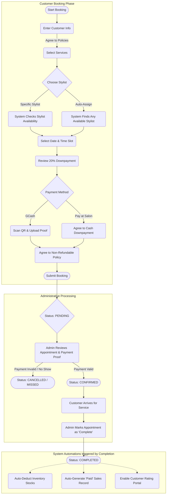

# Kaye's Hair Salon and Spa Appointment System

## Core Features and Processes

### 1. Customer Booking Process (Frontend)
The booking engine is designed to guide the customer step-by-step while enforcing salon policies.
*   **Customer Information:** Captures essential details (Name, Email, Phone, Address). Returning customers can use an OTP authentication to auto-fill their profile. Mandatory consent for Terms & Conditions and Data Privacy is enforced here.
*   **Service Selection:** Customers can browse categories, select core services, pick specific variations (e.g., hair length), and add multiple services to a single booking.
*   **Scheduling & Allocation:** Customers select a date and time. They can either pick a preferred stylist or use "Auto-assign". The system dynamically calculates available time slots by checking business hours, holiday closures, stylist working hours, and existing booking overlaps to prevent double-booking.
*   **Payment & Policies:** Enforces a minimum 20% downpayment calculation. Customers choose between "On-hand" (pay at salon) or "Online" (GCash). For GCash, dynamic QR codes are displayed. Customers must upload payment proof and explicitly agree to a Non-Refundable Payment Policy.
*   **Confirmation:** Upon submission, the appointment enters a "Pending / Booked" state awaiting admin verification.

### 2. Customer Portal
A lightweight dashboard for returning customers accessed via secure email OTP.
*   **History & Tracking:** Customers can view Upcoming, Completed, Cancelled, and Missed appointments.
*   **Rescheduling:** Customers can request to reschedule upcoming appointments, restricted to the exact day the booking was made to prevent last-minute schedule disruptions.
*   **Feedback System:** Allows customers to rate completed appointments (Service Rating, Stylist Rating, and written feedback).

### 3. Administrative Control Panel
A robust backend for Owners and Managers to control daily operations.
*   **Dashboard Overview:** High-level metrics showing daily/weekly revenue, appointment status breakdowns, low inventory alerts, and quick access to today's bookings.
*   **Appointment Management:** A unified calendar and list view to filter appointments by day, month, or year. Admins can "Confirm" pending bookings (verifying payment proof), "Complete" finished services, or "Reschedule" / "Cancel" appointments. 
*   **Sales & Financial Monitoring:** Detailed revenue tracking. When an appointment is marked "Completed", a corresponding "Paid" record is automatically injected into the Sales Monitor. Data can be filtered by date ranges, payment methods, and exported to a formatted PDF report.
*   **Customer Management:** A CRM module that tracks customer contact info, home addresses, total appointments, total monetary spend, and individual booking history.
*   **Service & Asset Management:** Admins can create/edit services, manage pricing, upload service catalog images, and manage the active GCash QR codes displayed during the booking flow.
*   **Staff & Schedule Management:** Admins manage Stylist profiles, active status, and define "Holidays" to block out the salon calendar globally.

### 4. Inventory Management
*   **Stock Tracking:** Tracks salon supplies, product costs, and current stock levels.
*   **Workflow Automation:** Services are mapped to specific inventory items. When an admin marks an appointment as "Completed," the system automatically deducts the necessary products/materials from the inventory.
*   **Low Stock Alerts:** Automatically warns the admin on the dashboard when critical supplies drop below a defined minimum threshold.

### 5. Automated System Jobs (Cron/Scheduler)
*   **Missed Appointment Handler:** A background process runs continuously to check appointment times. If an appointment's scheduled time passes without the customer arriving (and it isn't completed or explicitly cancelled), the system automatically flags it as "Missed" to free up metrics and close the ticket.

---

## System Flowchart

Below is a visual flowchart of the primary appointment lifecycle, from Customer Booking to Admin Fulfillment.

